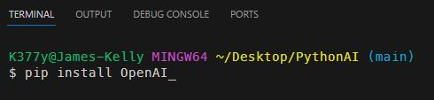
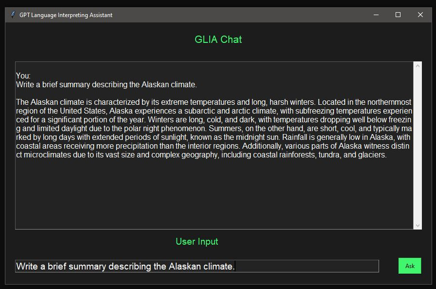

# ***GLIA(GPT Language Interpreting Assistant) - ChatGPT API using Python***

 

## Description
This is a personal project where I used the OpenAI API to build a clone of ChatGPT by using Python.   Information for usage of this API can be found here: ***https://platform.openai.com/docs/overview***   

## Table of Contents
- [Installation](#installation)
- [Usage](#usage)
- [Technologies](#technologies)
- [Questions](#questions)
- [License](#license)
 

## Installation
Obviously, make sure Python is installed on your computer. (Python 3.12.1 is current for this build) 
You will need to install the OpenAI Library:  

 
 

## Usage

 
 

## Technologies
- Python 3.12.1 - code building language
- OpenAI Library - API used to build the chatbot
- tkinter - GUI used to build the GUI interface of the chatbot
 
 

## Questions
For Questions, I can be reached at the following:
 
 

&emsp;&emsp;

## License

 Copyright (c) 2023 James Kelly
 Information on this license can be found at: (https://opensource.org/licenses/MIT)